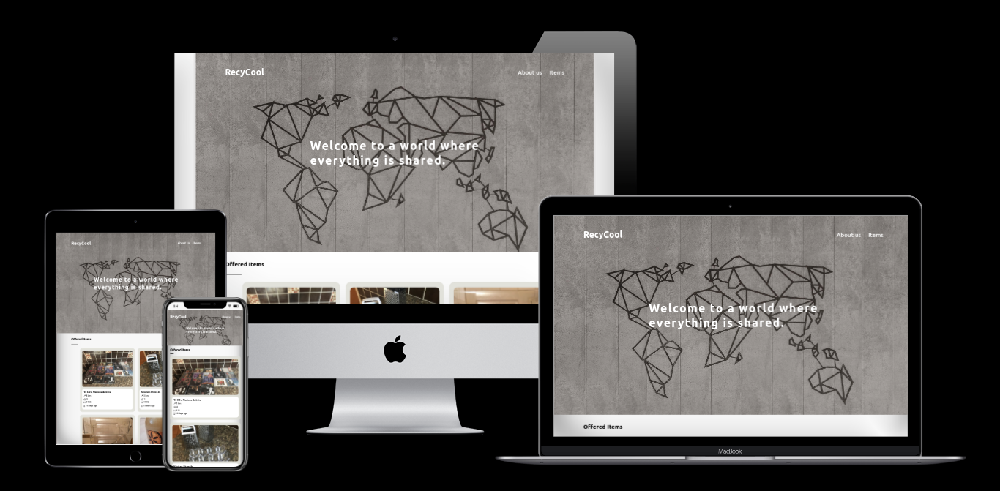

[](https://app.netlify.com/sites/recycool/deploys)
[](https://lbesson.mit-license.org/)
[](http://makeapullrequest.com)
[](https://github.com/ellerbrock/open-source-badges/)


# RecyCool

> Freecycling is a worldwide sharing movement that reduces waste, saves precious resources and eases the burden on landfills while enabling members to benefit from the strength of a caring community. RecyCool is a web app with the same mission. It builds on top of the Trash Nothing API - a popular online freecycle community.



## :tv: Media

[Live Demo Link](https://recycool.netlify.app/)

## MVP Features

The app features three main pages: Home, About, and Items. Each item can be viewed separately as a nested page. Items can be filtered and geolocation has been implemented to allow users to view items within 10 KM of their current location.

## :toolbox: Tools & Technologies Used

### Built with

- HTML5
- CSS3
- SCSS
- JavaScript ES6
- React 17.0.1
- Redux >4.0.5
- Jest v26.6

## :rocket: Getting Started

To get a local copy up and running follow these simple example steps.

### Prerequisites

Install [npm](https://www.npmjs.com/get-npm) or [Yarn](https://yarnpkg.com/cli/install)

Install [Node.js](https://nodejs.org/en/download/)

### Set up

Clone repo into your local environment:

Clone with SSH

```git
git clone git@github.com:cliftondavies/RecyCool.git
```

Clone with HTTPS

```git
git clone https://github.com/cliftondavies/RecyCool.git
```

Open project directory

```bash
cd [your-directory-name]
```

Install packages:

```javascript
npm install
```

Run tests:

```javascript
npm test
```

### Local Usage

#### In console

```javascript
npm start
```

#### In Browser

Visit `http://localhost:3000/`.

## Author

👤 **Clifton Davies**

- Github: [@githubhandle](https://github.com/cliftondavies)
- Twitter: [@twitterhandle](https://twitter.com/cliftonaedavies)
- Linkedin: [linkedin](https://www.linkedin.com/in/clifton-davies-mbcs/)

## 🤝 Contributing

Contributions, issues and feature requests are welcome!

## Show your support

Give a ⭐️ if you like this project!

## Acknowledgements

- [create-react-app](https://github.com/facebook/create-react-app)
- [Heroku buildpack for create-react-app](https://github.com/mars/create-react-app-buildpack)
- [Design inspiration](https://www.behance.net/gallery/54864337/Freecycle-redesign?tracking_source=search_projects_recommended%7CSitemap)
- [Geometric map image](https://unsplash.com/photos/6bXvYyAYVrE)
- [no image placeholder](https://commons.wikimedia.org/wiki/File:No-Image-Placeholder.svg)
- [Techsini multi-mockup generator](https://techsini.com/multi-mockup/)
- [Favicon generator](favicon.io)

## 📝 Copyright & License

Copyright (c) 2021 Clifton Davies.
This project is licensed under [MIT](https://opensource.org/licenses/MIT). See LICENSE file for details.
